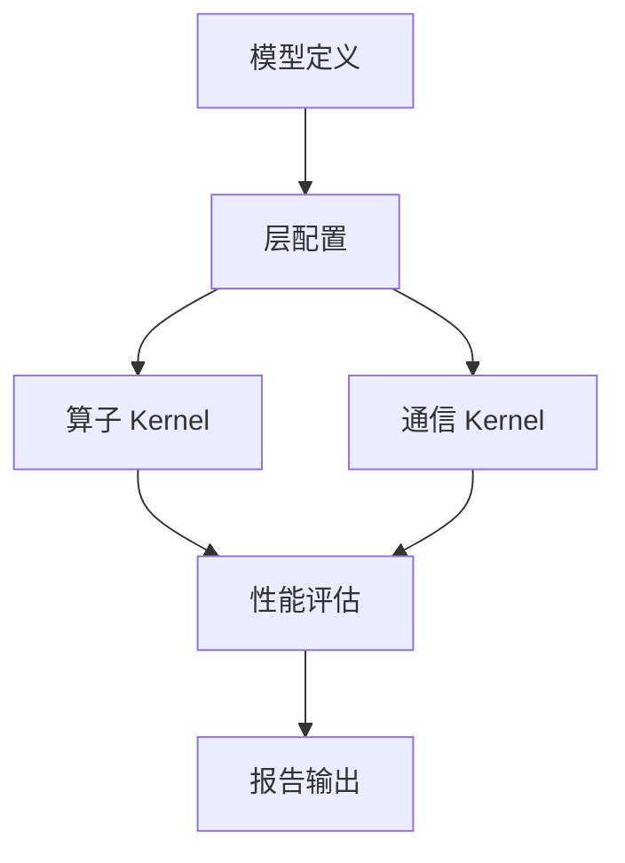

# LLM Performance Evaluator 文档

本文档详细介绍了 LLM Performance Evaluator 框架的设计原理、架构和使用方法。

## 文档目录

| 文档 | 内容概述 |
|------|----------|
| [architecture.md](./architecture.md) | 系统整体架构设计 |
| [kernel_modeling.md](./kernel_modeling.md) | Kernel 评估与建模方法 |
| [roofline_model.md](./roofline_model.md) | Roofline 性能模型详解 |
| [communication.md](./communication.md) | 通信建模与并行策略 |
| [topology.md](./topology.md) | 网络拓扑与分层带宽模型 (Clos/Fat-Tree) |
| [workflow.md](./workflow.md) | 工作流程与数据流 |
| [examples.md](./examples.md) | 典型使用场景示例 |
| [data_sources_wiki.md](./data_sources_wiki.md) | 数据来源汇总与参考 |

## 快速导航

### 核心概念

### 性能评估维度

| 维度 | 训练 | 推理 |
|------|------|------|
| **吞吐量** | tokens/sec | TTFT / TPOT / TPS |
| **延迟** | 每步时间 | 首token / 每token |
| **内存** | 参数+梯度+优化器 | 参数+KV Cache |
| **通信** | AllReduce 开销 | P2P / AllToAll |

## 设计目标

1. **准确性**: 基于 Roofline 模型和实际硬件特性建模
2. **灵活性**: 支持自定义模型、硬件和并行策略
3. **可扩展性**: 模块化设计，易于添加新的 Kernel 和策略
4. **实用性**: 提供详细的性能分解和优化建议

## 贡献指南

欢迎提交 Issue 和 PR 来改进文档和代码。请确保：
- 代码遵循现有风格
- 添加必要的测试和文档
- 更新相关的设计文档
