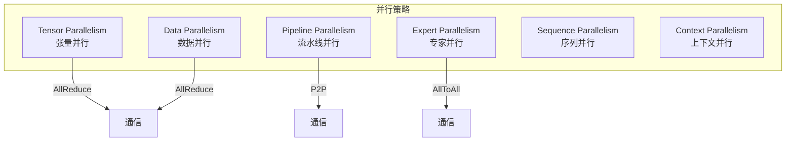
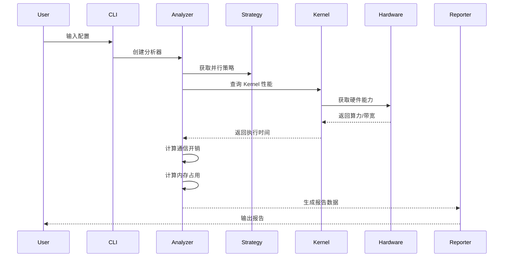

# 架构设计

## 整体架构

LLM Performance Evaluator 采用分层架构设计，将模型定义、硬件抽象、Kernel 评估、策略配置和性能分析解耦，实现高内聚低耦合的系统结构。

```
┌─────────────────────────────────────────────────────────────────┐
│                        Reporter Layer                           │
│  ┌─────────────┐  ┌─────────────┐  ┌─────────────────────────┐  │
│  │   Console   │  │    JSON     │  │          HTML           │  │
│  │   Table     │  │   Export    │  │    Visualization        │  │
│  └─────────────┘  └─────────────┘  └─────────────────────────┘  │
├─────────────────────────────────────────────────────────────────┤
│                        Analyzer Layer                           │
│  ┌─────────────────────┐  ┌─────────────────────────────────┐   │
│  │  Training Analyzer  │  │      Inference Analyzer         │   │
│  │  - Throughput       │  │  - TTFT (Time To First Token)   │   │
│  │  - Memory Usage     │  │  - TPOT (Time Per Output Token) │   │
│  │  - Comm Overhead    │  │  - TPS  (Tokens Per Second)     │   │
│  └─────────────────────┘  └─────────────────────────────────┘   │
├─────────────────────────────────────────────────────────────────┤
│                        Strategy Layer                           │
│  ┌──────────────────────────────────────────────────────────┐   │
│  │  Parallel Strategy (TP / PP / DP / EP / SP / CP)         │   │
│  │  - Device Assignment    - Communication Pattern          │   │
│  └──────────────────────────────────────────────────────────┘   │
├─────────────────────────────────────────────────────────────────┤
│                        Kernel Layer                             │
│  ┌────────────────────────┐  ┌──────────────────────────────┐   │
│  │   Compute Kernels      │  │   Communication Kernels      │   │
│  │  - GEMM                │  │  - AllReduce                 │   │
│  │  - Attention           │  │  - AllGather                 │   │
│  │  - Activation          │  │  - AllToAll                  │   │
│  │  - Normalization       │  │  - Broadcast                 │   │
│  └────────────────────────┘  └──────────────────────────────┘   │
├─────────────────────────────────────────────────────────────────┤
│                        Hardware Layer                           │
│  ┌────────────────────┐  ┌──────────────────────────────────┐   │
│  │   Device (GPU)     │  │   Cluster (Network Topology)     │   │
│  │  - Compute TFLOPS  │  │  - Intra-node Bandwidth          │   │
│  │  - Memory BW       │  │  - Inter-node Bandwidth          │   │
│  │  - Memory Capacity │  │  - Latency Model                 │   │
│  └────────────────────┘  └──────────────────────────────────┘   │
├─────────────────────────────────────────────────────────────────┤
│                        Model Layer                              │
│  ┌────────────────────┐  ┌──────────────────────────────────┐   │
│  │   Llama Model      │  │   MoE Model                      │   │
│  │  - Attention Layers│  │  - Expert Parallelism            │   │
│  │  - FFN Layers      │  │  - Router / Gate                 │   │
│  │  - Layer Config    │  │  - AllToAll Communication        │   │
│  └────────────────────┘  └──────────────────────────────────┘   │
└─────────────────────────────────────────────────────────────────┘
```

## 模块职责

### 1. Model Layer

**职责**: 定义模型结构和层配置

**核心类**:
| 类名 | 职责 |
|------|------|
| `BaseModel` | 抽象基类，定义模型接口 |
| `LlamaModel` | Llama 架构实现 |
| `MoEModel` | MoE 架构实现，支持 EP |
| `LayerConfig` | 层配置（输入/输出形状、参数量、FLOPs） |

**设计要点**:
- 每个 Layer 配置包含：输入/输出形状、参数量、FLOPs、激活内存
- 支持自动计算总参数量和总 FLOPs
- 区分 Dense Layer 和 MoE Layer

### 2. Hardware Layer

**职责**: 抽象硬件能力，提供性能上限估计

**核心类**:
| 类名 | 职责 |
|------|------|
| `Device` | 单卡 GPU 能力（算力、带宽、显存） |
| `Cluster` | 集群拓扑和通信带宽建模 |
| `NetworkConfig` | 网络配置（机内/机间带宽、延迟） |

**预设设备**:
| 设备 | FP16 TFLOPS | 显存 | 内存带宽 |
|------|-------------|------|----------|
| H100-SXM-80GB | 989 | 80GB | 3.35 TB/s |
| A100-SXM-80GB | 312 | 80GB | 2.04 TB/s |
| MI300X | 1307 | 192GB | 5.3 TB/s |

### 3. Kernel Layer

**职责**: 独立评估算子和通信性能

**设计原则**:
- **可插拔**: 每个 Kernel 可独立替换或扩展
- **可测量**: 支持理论建模和实测数据校准
- **可组合**: 多个 Kernel 可组合成复杂操作

### 4. Strategy Layer

**职责**: 管理并行策略和设备分配

**支持的并行方式**:



### 5. Analyzer Layer

**职责**: 综合分析性能并生成报告

**分析维度**:
1. **计算时间**: 基于 Roofline 模型
2. **通信时间**: 基于通信算法和带宽
3. **内存占用**: 参数、激活、KV Cache、优化器状态
4. **重叠优化**: 计算和通信的重叠

### 6. Reporter Layer

**职责**: 多格式报告输出

| 格式 | 适用场景 |
|------|----------|
| Console Table | 快速查看、命令行交互 |
| JSON | 程序化分析、数据存储 |
| HTML | 可视化展示、分享报告 |

## 数据流



## 扩展点

### 添加新模型

```python
class MyModel(BaseModel):
    def build_layers(self) -> List[LayerConfig]:
        # 实现层构建逻辑
        pass
```

### 添加新 Kernel

```python
# 在 ComputeKernelRegistry 中注册
self._kernels["custom_gemm"] = ComputeKernel(...)
```

### 添加新策略

```python
strategy = StrategyConfig(
    tp_degree=4,
    pp_degree=2,
    custom_option=True
)
```

## 关键技术选型

| 技术点 | 选型 | 理由 |
|--------|------|------|
| 性能模型 | Roofline | 统一描述计算和内存瓶颈 |
| 通信模型 | Ring/Tree 算法 | 实际分布式训练常用算法 |
| 建模方式 | 理论+实测 | 可校准，提高准确性 |
| 架构风格 | 分层+插件 | 易于扩展和维护 |
