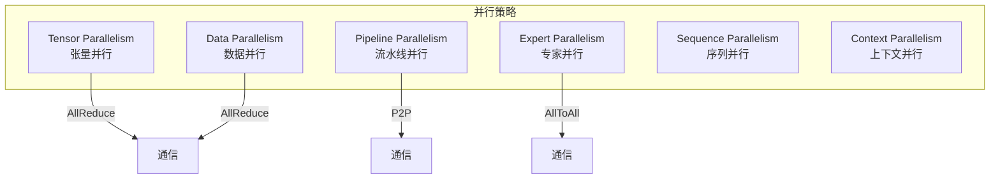
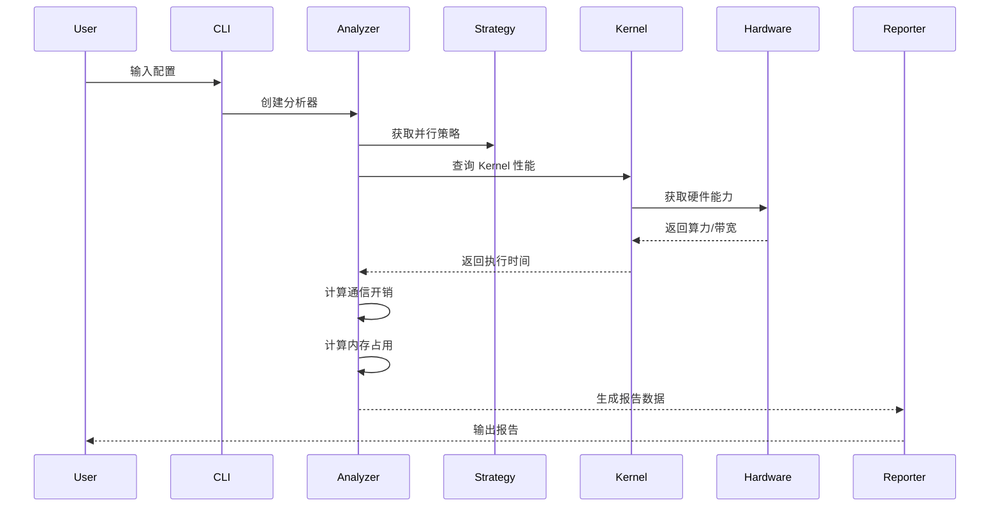

# 架构设计

## 整体架构

LLM Performance Evaluator 采用分层架构设计，将模型定义、硬件抽象、Kernel 评估、策略配置和性能分析解耦，实现高内聚低耦合的系统结构。

```
┌─────────────────────────────────────────────────────────────────┐
│                        Reporter Layer                           │
│  ┌─────────────┐  ┌─────────────┐  ┌─────────────────────────┐  │
│  │   Console   │  │    JSON     │  │          HTML           │  │
│  │   Table     │  │   Export    │  │    Visualization        │  │
│  └─────────────┘  └─────────────┘  └─────────────────────────┘  │
├─────────────────────────────────────────────────────────────────┤
│                        Analyzer Layer                           │
│  ┌─────────────────────┐  ┌─────────────────────────────────┐   │
│  │  Training Analyzer  │  │      Inference Analyzer         │   │
│  │  - Throughput       │  │  - TTFT (Time To First Token)   │   │
│  │  - Memory Usage     │  │  - TPOT (Time Per Output Token) │   │
│  │  - Comm Overhead    │  │  - TPS  (Tokens Per Second)     │   │
│  └─────────────────────┘  └─────────────────────────────────┘   │
├─────────────────────────────────────────────────────────────────┤
│                        Strategy Layer                           │
│  ┌──────────────────────────────────────────────────────────┐   │
│  │  Parallel Strategy (TP / PP / DP / EP / SP / CP)         │   │
│  │  - Device Assignment    - Communication Pattern          │   │
│  └──────────────────────────────────────────────────────────┘   │
├─────────────────────────────────────────────────────────────────┤
│                        Kernel Layer                             │
│  ┌────────────────────────┐  ┌──────────────────────────────┐   │
│  │   Compute Kernels      │  │   Communication Kernels      │   │
│  │  - GEMM (CUBE Core)    │  │  - AllReduce                 │   │
│  │  - Attention (FA/SDPA) │  │  - AllGather                 │   │
│  │  - Activation (VECTOR) │  │  - AllToAll                  │   │
│  │  - Normalization       │  │  - Broadcast                 │   │
│  │  - MLA (DeepSeek)      │  │                              │   │
│  └────────────────────────┘  └──────────────────────────────┘   │
├─────────────────────────────────────────────────────────────────┤
│                        Hardware Layer                           │
│  ┌────────────────────┐  ┌──────────────────────────────────┐   │
│  │   Device (GPU)     │  │   Cluster (Network Topology)     │   │
│  │  - Compute TFLOPS  │  │  - Intra-node Bandwidth          │   │
│  │  - Memory BW       │  │  - Inter-node Bandwidth          │   │
│  │  - Memory Capacity │  │  - Latency Model                 │   │
│  └────────────────────┘  └──────────────────────────────────┘   │
├─────────────────────────────────────────────────────────────────┤
│                        Model Layer                              │
│  ┌─────────────┐ ┌─────────────┐ ┌─────────────┐ ┌───────────┐  │
│  │Llama Model  │ │  MoE Model  │ │DeepSeek-V2/3│ │  ResNet   │  │
│  │- Attention  │ │- Expert Par │ │- MLA Attn   │ │- CNN Block │  │
│  │- FFN Layers │ │- Router/Gate│ │- GQA        │ │- Conv2d    │  │
│  └─────────────┘ └─────────────┘ └─────────────┘ └───────────┘  │
│  ┌─────────────┐ ┌─────────────┐ ┌───────────────────────────┐   │
│  │  VAE Model  │ │ Wan Video   │ │         ...               │   │
│  │- Conv3d     │ │- DiT Block  │ │                           │   │
│  │- Encoder/Dec│ │- Text Enc   │ │                           │   │
│  └─────────────┘ └─────────────┘ └───────────────────────────┘   │
└─────────────────────────────────────────────────────────────────┘
```

## 模块职责

### 1. Model Layer

**职责**: 定义模型结构和层配置，使用 Kernel API 构建层

**核心类**:
| 类名 | 职责 |
|------|------|
| `BaseModel` | 抽象基类，定义模型接口 |
| `LlamaModel` | Llama 架构实现（支持 GQA） |
| `MoEModel` | MoE 架构实现，支持 EP |
| `DeepSeekModel` | DeepSeek-V2/V3 架构，支持 MLA |
| `LayerConfig` | 层配置（输入/输出形状、参数量、FLOPs） |

**设计要点**:
- 每个 Layer 配置包含：输入/输出形状、参数量、FLOPs、激活内存
- 模型使用 `kernel_result_to_layer()` 从 KernelResult 构建 LayerConfig
- KernelResult 自动包含 params、flops、memory 信息
- 支持自动计算总参数量和总 FLOPs

**模型构建示例**:
```python
from llm_perf.kernels import linear, rms_norm, scaled_dot_product_attention
from llm_perf.kernels.utils import kernel_result_to_layer

# 使用 Kernel API 构建层
q_result = linear(input=(m, hidden_size), weight=(q_dim, hidden_size), dtype="fp16")
layers.append(kernel_result_to_layer(name="q_proj", result=q_result))
```

### 2. Hardware Layer

**职责**: 抽象硬件能力，提供性能上限估计

**核心类**:
| 类名 | 职责 |
|------|------|
| `Device` | 单卡 GPU 能力（算力、带宽、显存） |
| `Cluster` | 集群拓扑和通信带宽建模 |
| `NetworkConfig` | 网络配置（机内/机间带宽、延迟） |

**预设设备**:
| 设备 | FP16 TFLOPS | 显存 | 内存带宽 |
|------|-------------|------|----------|
| H100-SXM-80GB | 989 | 80GB | 3.35 TB/s |
| A100-SXM-80GB | 312 | 80GB | 2.04 TB/s |
| MI300X | 1307 | 192GB | 5.3 TB/s |
| Ascend-910B2 | 376 | 64GB | 1.6 TB/s |

### 3. Kernel Layer

**职责**: 独立评估算子和通信性能

**设计原则**:
- **可插拔**: 每个 Kernel 可独立替换或扩展
- **可测量**: 支持理论建模和实测数据校准
- **自动计算**: memory_bound 基于算术强度自动判断

**Kernel 分类**:

| 类型 | 计算单元 | 典型 Kernel | 特点 |
|------|----------|-------------|------|
| Compute (Dense) | CUBE/Tensor Core | `linear`, `bmm`, `conv2d` | 高算术强度 |
| Compute (Sparse) | CUBE/Tensor Core | `flash_attention`, `mla_attention` | 内存优化 |
| Element-wise | VECTOR/CUDA Core | `silu`, `rms_norm`, `softmax` | 低算术强度 |
| Communication | N/A | `allreduce`, `alltoall` | 网络带宽受限 |

**Memory Bound 判断**:
```python
# 基于算术强度自动判断
threshold_cube = 200.0   # CUBE/Tensor Core: ~200 FLOPs/byte
threshold_vector = 50.0  # VECTOR/CUDA Core: ~50 FLOPs/byte

memory_bound = (arithmetic_intensity < threshold)
```

### 4. Strategy Layer

**职责**: 管理并行策略和设备分配

**支持的并行方式**:



### 5. Analyzer Layer

**职责**: 综合分析性能并生成报告

**分析维度**:
1. **计算时间**: 基于 Roofline 模型
2. **通信时间**: 基于通信算法和带宽
3. **内存占用**: 参数、激活、KV Cache、优化器状态
4. **重叠优化**: 计算和通信的重叠

### 6. Reporter Layer

**职责**: 多格式报告输出

| 格式 | 适用场景 |
|------|----------|
| Console Table | 快速查看、命令行交互 |
| JSON | 程序化分析、数据存储 |
| HTML | 可视化展示、分享报告 |

## Kernel API 架构

### KernelResult 数据结构

```python
@dataclass
class KernelResult:
    output: Tuple[int, ...]       # 输出形状
    flops: int                    # FLOPs
    bytes_accessed: int           # 内存访问字节数
    arithmetic_intensity: float   # 算术强度 (FLOPs/byte)
    memory_bound: bool            # 是否内存受限（自动计算）
    params: int = 0               # 参数量
    param_bytes: int = 0          # 参数字节数
    unit_type: str = "vector"     # 计算单元类型
    dtype: str = "fp16"           # 数据类型
```

### 主要 Kernel 函数

| 函数 | 描述 | 支持的特性 |
|------|------|-----------|
| `linear` | 矩阵乘法 | CUBE Core, 自动参数计算 |
| `scaled_dot_product_attention` | 标准 Attention | GQA 支持 |
| `flash_attention` | Flash Attention | 分块优化，减少 HBM 流量 |
| `mla_attention` | MLA Attention | absorb/non-absorb 模式 |
| `rms_norm` / `layer_norm` | 归一化 | VECTOR Core |
| `silu` / `gelu` / `relu` | 激活函数 | VECTOR Core |
| `conv2d` / `conv3d` | 卷积 | CUBE Core |
| `embedding` | 嵌入查找 | VECTOR Core |

### 工具函数

```python
from llm_perf.kernels.utils import kernel_result_to_layer

# 将 KernelResult 转换为 LayerConfig
layer = kernel_result_to_layer(
    name="linear_0",
    result=kernel_result,
    is_moe=False  # 可选
)
```

## 数据流



## 扩展点

### 添加新模型

```python
from llm_perf.models.base import BaseModel, LayerConfig
from llm_perf.kernels import linear, rms_norm
from llm_perf.kernels.utils import kernel_result_to_layer

class MyModel(BaseModel):
    def build_layers(self) -> List[LayerConfig]:
        layers = []
        
        # 使用 Kernel API 构建层
        result = linear(...)
        layers.append(kernel_result_to_layer(name="proj", result=result))
        
        return layers
```

### 添加新 Kernel

```python
from llm_perf.kernels.functional import KernelResult

def my_custom_kernel(input_shape, dtype="fp16") -> KernelResult:
    # 计算 FLOPs 和内存访问
    flops = ...
    bytes_accessed = ...
    
    return KernelResult(
        output=output_shape,
        flops=flops,
        bytes_accessed=bytes_accessed,
        arithmetic_intensity=flops / bytes_accessed,
        memory_bound=False,  # 会自动重新计算
        input_shapes=[input_shape],
        unit_type="cube",    # 或 "vector"
        dtype=dtype
    )
```

### 添加新策略

```python
from llm_perf.strategy.base import StrategyConfig

strategy = StrategyConfig(
    tp_degree=4,
    pp_degree=2,
    dp_degree=2,
    custom_option=True
)
```

## 关键技术选型

| 技术点 | 选型 | 理由 |
|--------|------|------|
| 性能模型 | Roofline | 统一描述计算和内存瓶颈 |
| 通信模型 | Ring/Tree 算法 | 实际分布式训练常用算法 |
| 建模方式 | 理论+实测 | 可校准，提高准确性 |
| 架构风格 | 分层+插件 | 易于扩展和维护 |
| Kernel API | Torch-like | 开发者友好，易于上手 |
| Memory Bound | 算术强度阈值 | 基于硬件特性自动判断 |

## 最近更新

### v2.0 (最新)
- **Kernel API 重构**: 简化 `kernel_result_to_layer`，自动推断 dtype 和 params
- **Attention 模块完善**: 支持 Flash Attention、GQA、MLA (absorb/non-absorb)
- **Memory Bound 自动计算**: 基于算术强度和计算单元类型自动判断
- **移除冗余代码**: layers.py 移至 examples，减少核心库维护负担
