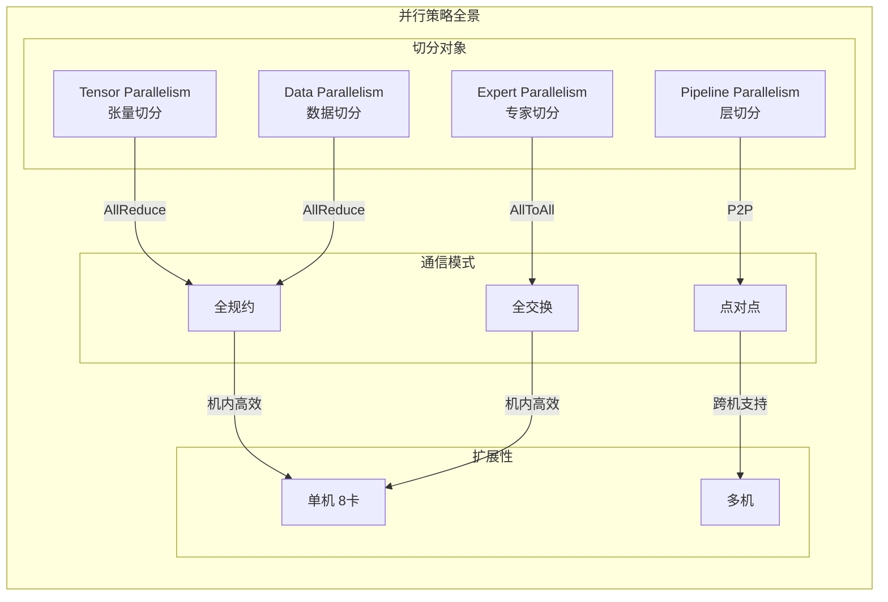
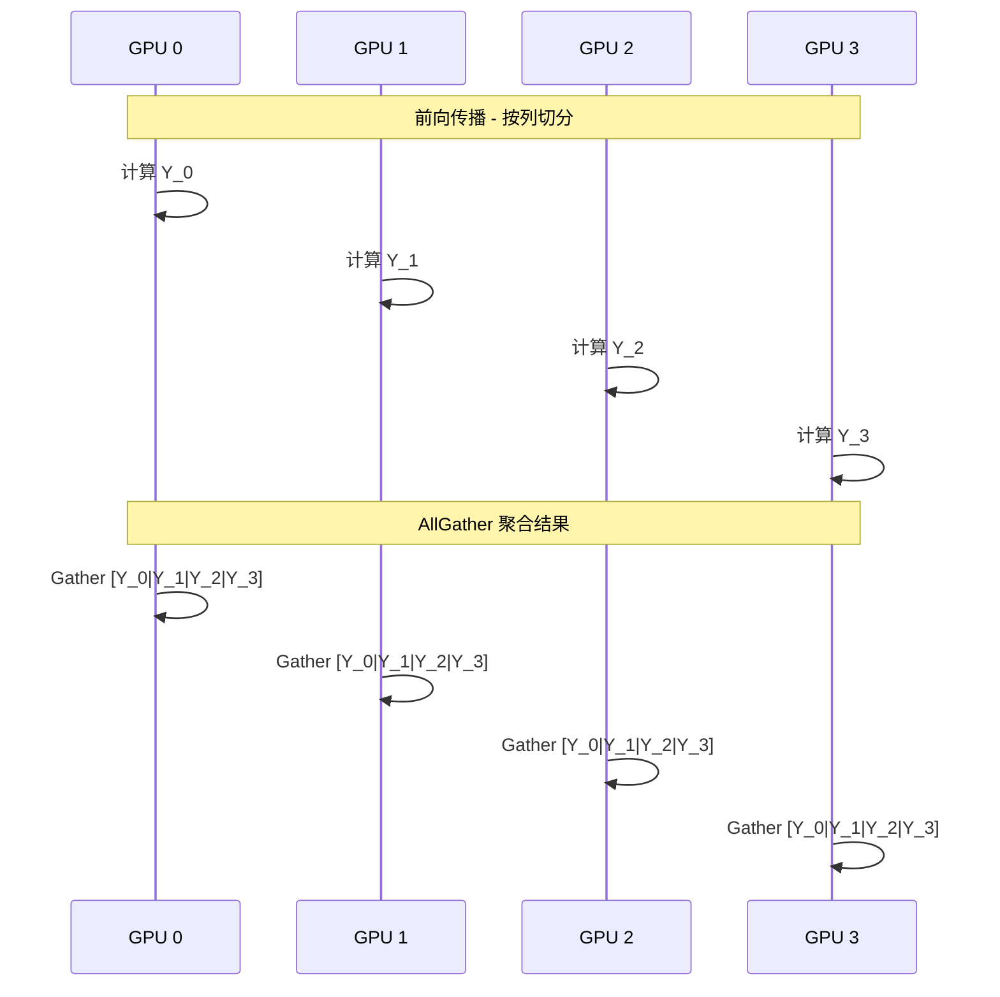
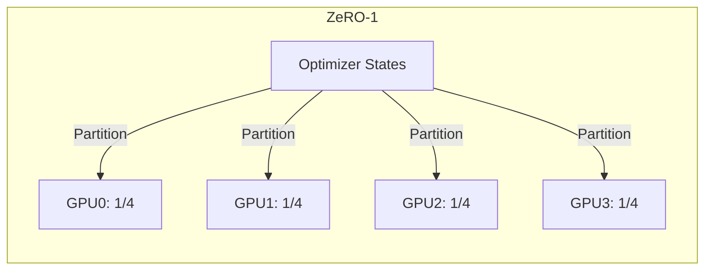
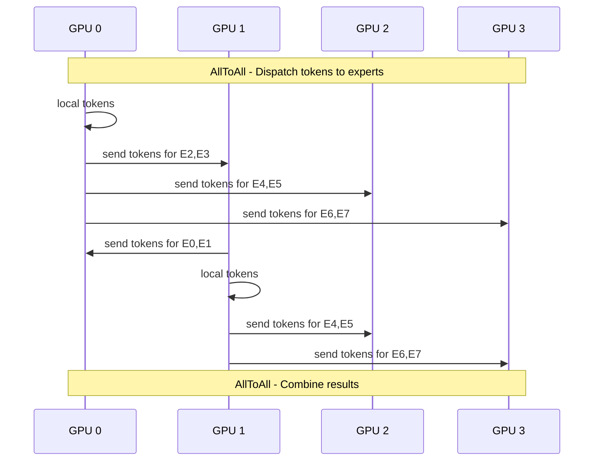
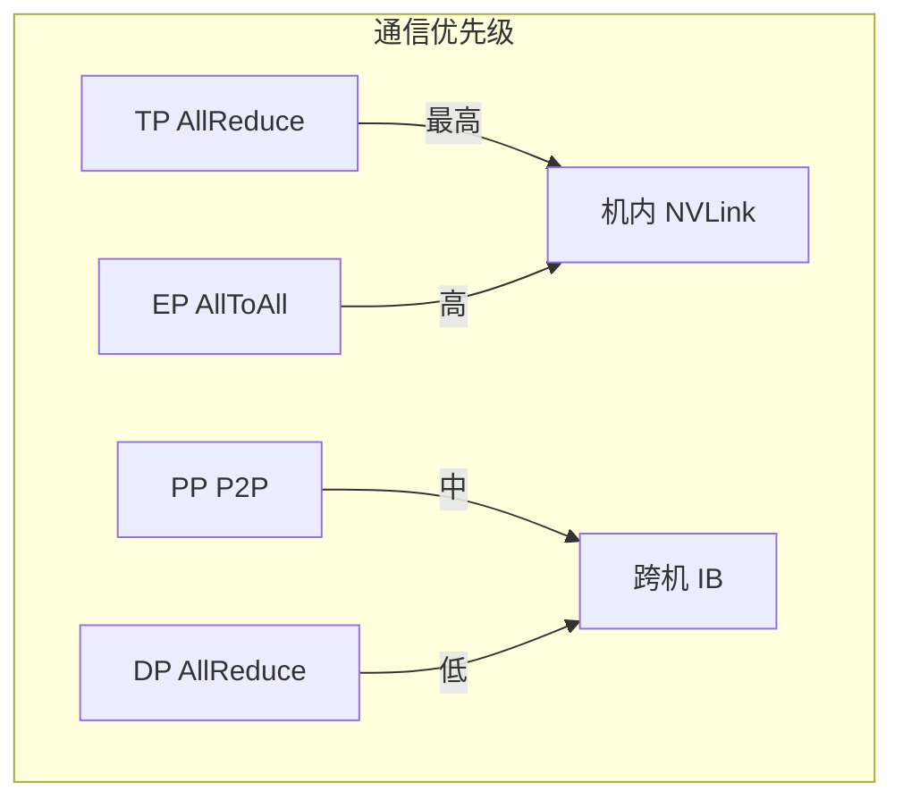

# 通信建模与并行策略

通信开销是大模型分布式训练/推理的主要瓶颈之一。本文档详细介绍各类并行策略中的通信模式及其建模方法。

## 1. 并行策略概述

### 1.1 并行方式对比



### 1.2 并行策略特性表

| 并行方式 | 切分维度 | 主要通信 | 扩展性 | 适用场景 |
|----------|----------|----------|--------|----------|
| **TP** | 隐藏维度 | AllReduce | 机内 (≤8) | 单卡放不下 |
| **PP** | 层维度 | P2P | 跨机 | 长序列、大模型 |
| **DP** | 数据批次 | AllReduce | 跨机 | 提升吞吐 |
| **EP** | 专家维度 | AllToAll | 机内/跨机 | MoE 模型 |
| **SP** | 序列维度 | AllGather | 机内 | 长序列训练 |
| **CP** | 上下文维度 | Ring Attention | 跨机 | 超长上下文 |

## 2. Tensor Parallelism (TP)

### 2.1 TP 切分原理

以线性层 Y = X × W 为例，权重矩阵 W 可以按列或按行切分：

**按列切分 (Column-wise)**:
```
        W_1                W_2
    ┌──────────┐       ┌──────────┐
    │          │       │          │
X ──┤  GPU 0   │  +  X─┤  GPU 1   │
    │          │       │          │
    └──────────┘       └──────────┘
        Y_1                Y_2
    
    Y = [Y_1 | Y_2]  ← AllGather
```

**按行切分 (Row-wise)**:
```
        W_1                W_2
    ┌──────────┐       ┌──────────┐
    │          │       │          │
X_1─┤          │  +  X₂┤          │
    │  GPU 0   │       │  GPU 1   │
    │          │       │          │
    └──────────┘       └──────────┘
        Y_1                Y_2
        
    Y = Y_1 + Y_2  ← AllReduce
```

### 2.2 TP 通信模式



### 2.3 TP 通信量分析

对于 Transformer Layer：

| 操作 | 切分方式 | 通信类型 | 通信量 |
|------|----------|----------|--------|
| Q/K/V Projection | 列切分 | AllGather | 3 × batch × seq × hidden × (tp-1)/tp |
| Attention | 列切分 | AllGather | batch × seq × hidden × (tp-1)/tp |
| O Projection | 行切分 | AllReduce | batch × seq × hidden |
| FFN Up/Gate | 列切分 | AllGather | 2 × batch × seq × intermediate × (tp-1)/tp |
| FFN Down | 行切分 | AllReduce | batch × seq × hidden |

**每层总通信量**:
```
总通信量 = 4 × batch × seq × hidden × dtype_size  (AllReduce)
        + 5 × batch × seq × hidden × (tp-1)/tp × dtype_size  (AllGather)
```

### 2.4 TP 性能模型

**通信时间** (Ring AllReduce):
```
T_tp = 2 × (tp-1)/tp × data_size / bandwidth + tp × latency
```

**与计算重叠**:

```mermaid
gantt
    title TP 计算与通信重叠
    dateFormat X
    axisFormat %s
    
    section GPU 0
    Compute Q/K/V    : 0, 10
    AllReduce O      : 8, 18
    Compute FFN      : 10, 20
    AllReduce FFN    : 18, 28
```


理想情况下，AllReduce 可以与下一层的计算部分重叠。

## 3. Data Parallelism (DP)

### 3.1 DP 基本原理

```
┌─────────────────────────────────────────────────────────┐
│                    Global Batch                         │
│  ┌──────────┐  ┌──────────┐  ┌──────────┐  ┌──────────┐│
│  │ Batch 0  │  │ Batch 1  │  │ Batch 2  │  │ Batch 3  ││
│  │  GPU 0   │  │  GPU 1   │  │  GPU 2   │  │  GPU 3   ││
│  └──────────┘  └──────────┘  └──────────┘  └──────────┘│
│       │              │              │              │     │
│       ▼              ▼              ▼              ▼     │
│  ┌──────────┐  ┌──────────┐  ┌──────────┐  ┌──────────┐│
│  │ Forward  │  │ Forward  │  │ Forward  │  │ Forward  ││
│  │ Backward │  │ Backward │  │ Backward │  │ Backward ││
│  └──────────┘  └──────────┘  └──────────┘  └──────────┘│
│       │              │              │              │     │
│       └──────────────┴──────────────┘              │     │
│                    AllReduce Gradients               │     │
│       ┌──────────────┬──────────────┐              │     │
│       ▼              ▼              ▼              ▼     │
│  ┌──────────┐  ┌──────────┐  ┌──────────┐  ┌──────────┐│
│  │ Optimizer│  │ Optimizer│  │ Optimizer│  │ Optimizer││
│  │  Step    │  │  Step    │  │  Step    │  │  Step    ││
│  └──────────┘  └──────────┘  └──────────┘  └──────────┘│
└─────────────────────────────────────────────────────────┘
```

### 3.2 ZeRO 优化

ZeRO (Zero Redundancy Optimizer) 通过切分优化器状态减少内存：

| Stage | 说明 | 内存节省 | 通信开销 |
|-------|------|----------|----------|
| **ZeRO-1** | 切分优化器状态 | 4x | 不变 |
| **ZeRO-2** | + 切分梯度 | 8x | 不变 |
| **ZeRO-3** | + 切分参数 | 与 DP 度数线性相关 | 2x |



### 3.3 DP 通信模型

**标准 DP**:
```
通信量 = 2 × model_params × dtype_size  (每次迭代)
时间 = 2 × (dp-1)/dp × params × dtype_size / bandwidth
```

**ZeRO-3**:
```
通信量 = 3 × model_params × dtype_size  (参数+梯度+优化器)
时间增加约 1.5x
```

## 4. Pipeline Parallelism (PP)

### 4.1 PP 切分

```
Model Layers: [0, 1, 2, ..., 31]

PP=4 切分:
┌─────────────────────────────────────────────────────┐
│  Stage 0    Stage 1    Stage 2    Stage 3           │
│  ┌──────┐   ┌──────┐   ┌──────┐   ┌──────┐         │
│  │ 0-7  │──▶│ 8-15 │──▶│ 16-23│──▶│ 24-31│         │
│  │ GPU0 │   │ GPU1 │   │ GPU2 │   │ GPU3 │         │
│  └──────┘   └──────┘   └──────┘   └──────┘         │
└─────────────────────────────────────────────────────┘
```

### 4.2 流水线调度

**GPipe** (填充-流水线-排空):
```
Time →
GPU 0: FFFF____RRRR____
GPU 1: __FFFF____RRRR__
GPU 2: ____FFFF____RRRR
GPU 3: ______FFFF____RR

F = Forward, R = Backward, _ = 空闲 (Bubble)
```

**1F1B** (One Forward One Backward):
```
GPU 0: FFFFFRFFFFFR
GPU 1: _FFFFF_RFFFFFR
GPU 2: __FFFFF__RFFFFFR
GPU 3: ___FFFFF___RFFFFFR

Bubble 更小，显存更高效
```

### 4.3 PP 通信模型

**通信量** (每 micro-batch):
```
激活大小 = micro_batch × seq_len × hidden_size × dtype_size

机内 P2P: 时间 = activation_size / nvlink_bw
机间 P2P: 时间 = activation_size / ib_bw
```

**气泡开销**:
```
Bubble 比例 = (pp - 1) / num_micro_batches
```

## 5. Expert Parallelism (EP)

### 5.1 EP 原理

MoE 模型中，EP 将不同专家分配到不同 GPU：

```
Token Routing:
┌───────────────────────────────────────────────────────┐
│ Input Tokens: [t1, t2, t3, t4, t5, t6, t7, t8]       │
│                                                       │
│ Router: top-2 experts per token                      │
│                                                       │
│ GPU 0 (E0, E1): t1, t3, t5 ──▶ AllToAll ──▶ Compute │
│ GPU 1 (E2, E3): t2, t4, t6 ──▶ AllToAll ──▶ Compute │
│ GPU 2 (E4, E5): t1, t7     ──▶ AllToAll ──▶ Compute │
│ GPU 3 (E6, E7): t2, t8     ──▶ AllToAll ──▶ Compute │
└───────────────────────────────────────────────────────┘
```

### 5.2 EP 通信模式

**Dispatch (分发)**:


### 5.3 EP 通信量

```
假设:
- batch_size = B, seq_len = S
- num_experts = E, ep_degree = ep
- num_experts_per_token = k

每个 token 需要发送到 k 个专家
平均每个专家处理的 token 数 = B × S × k / E

AllToAll 通信量:
- Send: B × S × k × hidden × dtype_size
- Receive: B × S × k × hidden × dtype_size

总通信量 = 2 × B × S × k × hidden × dtype_size
```

### 5.4 EP 性能模型

```
通信时间 = 2 × (ep-1)/ep × token_bytes / bandwidth

计算时间 (Expert FFN):
- 每个专家: 2 × tokens_per_expert × intermediate × hidden × 2 FLOPs
- 并行度: ep
```

## 6. 混合并行策略

### 6.1 3D Parallelism

```
TP=2, PP=2, DP=2:
┌─────────────────────────────────────────────────────────────┐
│                      DP Group 0                             │
│  ┌──────────────────────┐  ┌──────────────────────┐        │
│  │     PP Stage 0       │  │     PP Stage 1       │        │
│  │  ┌─────┐  ┌─────┐   │  │  ┌─────┐  ┌─────┐   │        │
│  │  │GPU0 │──│GPU1 │   │──▶│  │GPU2 │──│GPU3 │   │        │
│  │  │ TP  │  │ TP  │   │  │  │ TP  │  │ TP  │   │        │
│  │  └─────┘  └─────┘   │  │  └─────┘  └─────┘   │        │
│  └──────────────────────┘  └──────────────────────┘        │
├─────────────────────────────────────────────────────────────┤
│                      DP Group 1                             │
│  ┌──────────────────────┐  ┌──────────────────────┐        │
│  │     PP Stage 0       │  │     PP Stage 1       │        │
│  │  ┌─────┐  ┌─────┐   │  │  ┌─────┐  ┌─────┐   │        │
│  │  │GPU4 │──│GPU5 │   │──▶│  │GPU6 │──│GPU7 │   │        │
│  │  │ TP  │  │ TP  │   │  │  │ TP  │  │ TP  │   │        │
│  │  └─────┘  └─────┘   │  │  └─────┘  └─────┘   │        │
│  └──────────────────────┘  └──────────────────────┘        │
└─────────────────────────────────────────────────────────────┘
```

### 6.2 通信优先级



### 6.3 总通信开销

```
总通信时间 = 
    T_tp_allreduce × num_layers + 
    T_ep_alltoall × num_moe_layers × 2 +
    T_pp_p2p × num_stages +
    T_dp_allreduce × (1 / num_micro_batches)
```

## 7. 通信优化建议

| 场景 | 推荐配置 | 理由 |
|------|----------|------|
| 单机 8 卡 | TP=8 或 TP=4+DP=2 | NVLink 高效 |
| 双机 16 卡 | TP=8 + DP=2 | 机内 TP，机间 DP |
| 长序列 | TP=4 + PP=2 + SP | 序列并行降低激活 |
| MoE 模型 | TP=2 + EP=4 | EP 减少专家内存 |
| 超大模型 | TP=8 + PP=4 + DP=N | 3D 并行扩展 |
