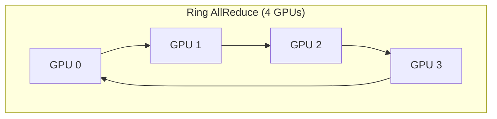
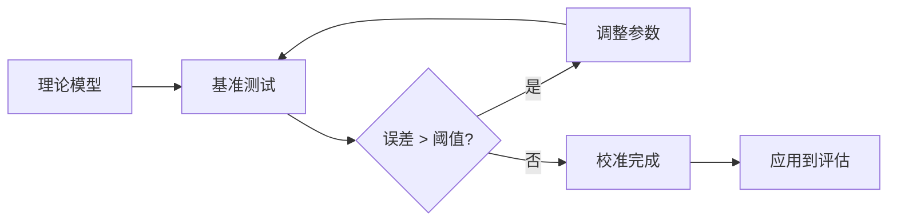

# Kernel 建模详解

Kernel 建模是性能评估的核心，本文档详细介绍各类 Kernel 的建模方法。

## 1. 计算 Kernel (Compute Kernels)

### 1.1 GEMM (General Matrix Multiply)

GEMM 是最基础的计算 Kernel，形式为：C = A × B

**FLOPs 计算**:
```
FLOPs = 2 × M × N × K
```
- 2: 乘加操作 (multiply-add)
- M, N, K: 矩阵维度

**内存访问**:
```
Bytes = (M×K + K×N + M×N) × dtype_size
```

**算术强度**:
```
AI = FLOPs / Bytes = 2 × M × N × K / (M×K + K×N + M×N) / dtype_size
```

**常见配置分析**:

| 配置 | M | N | K | FLOPs | 算术强度 (FP16) | 瓶颈 |
|------|---|---|---|-------|-----------------|------|
| 小 batch | 1 | 4096 | 4096 | 33.5M | 0.5 | 内存带宽 |
| 大 batch | 4096 | 4096 | 4096 | 137G | 682 | 计算 |
| FFN up | 1 | 11008 | 4096 | 90M | 0.5 | 内存带宽 |
| Attention QK | 4096 | 4096 | 128 | 4.3G | 5.3 | 混合 |

### 1.2 FlashAttention

FlashAttention 通过分块 (tiling) 和重计算减少 HBM 访问。

**标准 Attention 复杂度**:
```
计算: O(batch × heads × seq² × head_dim)
内存: O(batch × heads × seq²)  # 注意力矩阵
```

**FlashAttention 优化**:
- 分块计算 Softmax，避免存储完整注意力矩阵
- 使用 SRAM 缓存中间结果
- 重计算代替存储

**FLOPs** (与标准 Attention 相同):
```
FLOPs = 4 × batch × heads × seq² × head_dim
```

**内存访问** (显著降低):
```
Bytes = batch × heads × seq × head_dim × (read Q,K,V + write O)
      ≈ 4 × batch × heads × seq × head_dim × dtype_size
```

**算术强度提升**:
```
标准 Attention: AI = head_dim / dtype_size
FlashAttention: AI ≈ seq × head_dim / (4 × head_dim) = seq / 4
```

当 seq=4096 时，FlashAttention 的算术强度是标准实现的 1000 倍以上。

### 1.3 激活函数

激活函数通常是**内存带宽瓶颈**。

| 激活函数 | FLOPs/element | 典型实现 |
|----------|---------------|----------|
| ReLU | 1 | max(0, x) |
| GELU | ~10 | 0.5×x×(1+tanh(√(2/π)×(x+0.044715×x³))) |
| SiLU | ~8 | x × sigmoid(x) |
| SwiGLU | ~16 | 两个线性投影 + SiLU + 乘法 |

**性能特征**:
```
Time ≈ 2 × num_elements × dtype_size / memory_bandwidth
```
- 2: 读输入 + 写输出
- 实际计算时间可忽略

## 2. 通信 Kernel (Communication Kernels)

### 2.1 AllReduce

AllReduce 是最常用的集合通信操作，用于梯度同步和 TP 结果聚合。

**Ring AllReduce 算法**:



**时间复杂度**:
```
时间 = 2 × (n-1)/n × data_size / bandwidth + n × latency
```
- 2×(n-1) 步通信
- 每步传输 data_size/n 数据

**带宽效率**:

| GPU 数量 | 理论带宽效率 | 实际效率 |
|----------|--------------|----------|
| 2 | 50% | ~45% |
| 4 | 75% | ~70% |
| 8 | 87.5% | ~80% |

### 2.2 AllToAll

AllToAll 用于 MoE 的 token 分发，每个 rank 向所有其他 rank 发送数据。

**时间模型**:
```
时间 = (n-1)/n × data_size / bandwidth
```

**与 AllReduce 对比**:
- AllToAll 每个 rank 发送不同数据到不同目的地
- AllReduce 所有 rank 最终获得相同结果
- AllToAll 带宽利用率通常更高

### 2.3 P2P (Point-to-Point)

P2P 用于 Pipeline Parallelism 的激活传递。

**时间模型**:
```
时间 = data_size / bandwidth + latency
```

**机内 vs 机间**:

| 场景 | 带宽 | 延迟 | 适用 |
|------|------|------|------|
| 机内 P2P (NVLink) | 900 GB/s | ~1μs | TP, 小规模 PP |
| 机间 P2P (IB) | 400 Gb/s | ~2μs | 跨节点 PP |

## 3. Kernel 组合与重叠

### 3.1 计算-通信重叠

现代 GPU 支持计算和通信并行执行：

```mermaid
gantt
    title 计算与通信重叠
    dateFormat X
    axisFormat %s
    
    section GPU 0
    Compute 1           : 0, 10
    Communication       : 5, 15
    Compute 2           : 15, 25
    
    section GPU 1
    Compute 1           : 0, 10
    Communication       : 5, 15
    Compute 2           : 15, 25
```



**重叠效率**:
```
实际时间 = max(compute_time, comm_time) + non_overlap_time
```

### 3.2 TP 中的 Kernel 序列

典型的 Transformer Layer 在 TP=2 时的执行流程：

```
GPU 0                              GPU 1
  │                                  │
  ▼                                  ▼
┌──────────────┐              ┌──────────────┐
│  Q Projection │              │  Q Projection │
│  (1/2 params) │              │  (1/2 params) │
└──────────────┘              └──────────────┘
  │                                  │
  ▼                                  ▼
┌──────────────┐              ┌──────────────┐
│  K Projection │              │  K Projection │
└──────────────┘              └──────────────┘
  │                                  │
  ▼                                  ▼
┌──────────────┐              ┌──────────────┐
│  V Projection │              │  V Projection │
└──────────────┘              └──────────────┘
  │                                  │
  ▼                                  ▼
┌──────────────┐              ┌──────────────┐
│   Attention   │              │   Attention   │
└──────────────┘              └──────────────┘
  │                                  │
  ▼                                  ▼
┌──────────────┐              ┌──────────────┐
│  O Projection │              │  O Projection │
└──────────────┘              └──────────────┘
  │                                  │
  ◄──────── AllReduce ───────────────►
  │                                  │
  ▼                                  ▼
┌──────────────┐              ┌──────────────┐
│     FFN      │              │     FFN      │
└──────────────┘              └──────────────┘
  │                                  │
  ◄──────── AllReduce ───────────────►
```

## 4. Kernel 校准

### 4.1 实测数据集成

框架支持用实测数据替换理论模型：

```python
kernel_config = KernelConfig(
    name="custom_gemm",
    measured_flops=850e12,  # 实测 FLOPS
    measured_bw=2800e9,      # 实测带宽
)
```

### 4.2 校准流程



### 4.3 常见校准参数

| 参数 | 理论值 | 典型实际值 | 说明 |
|------|--------|------------|------|
| GEMM 效率 | 100% | 70-85% | 内存访问模式、bank conflict |
| Attention 效率 | 100% | 60-75% | Softmax 归约、分块开销 |
| AllReduce 效率 | (n-1)/n | 略低 5-10% | 同步开销、负载不均衡 |
| 内存带宽 | 标称值 | 80-90% | ECC、协议开销 |

## 5. 性能建模示例

### 5.1 单一 GEMM 操作

以 Llama-7B 的 Q Projection 为例：
- 输入: [1, 4096], 输出: [1, 4096]
- 参数: 4096 × 4096 = 16.7M
- FLOPs: 2 × 1 × 4096 × 4096 = 33.5M
- 内存: (1×4096 + 4096×4096 + 1×4096) × 2 = 32.8MB

**在 H100 上的性能**:
```
算术强度 = 33.5M / 32.8M = 1.02 FLOPs/byte

Roofline:
- Ridge point = 989 TFLOPS / 3.35 TB/s = 295
- 1.02 < 295, 所以内存带宽瓶颈

理论时间 = 32.8MB / 3.35TB/s = 9.8μs
考虑 80% 效率: 12.3μs
```

### 5.2 完整 Attention Layer

包含 Q/K/V/O Projection + Attention 计算：

| 操作 | FLOPs | 内存 | 时间估计 |
|------|-------|------|----------|
| Q Proj | 33.5M | 32.8MB | 12μs |
| K Proj | 33.5M | 32.8MB | 12μs |
| V Proj | 33.5M | 32.8MB | 12μs |
| Attention | 4.3G | 64MB | 150μs |
| O Proj | 33.5M | 32.8MB | 12μs |
| **总计** | **4.5G** | **195MB** | **~200μs** |

**批处理扩展** (batch=8):
- FLOPs 线性增长: 4.5G × 8 = 36G
- 时间亚线性增长: ~800μs (更好的计算利用率)
