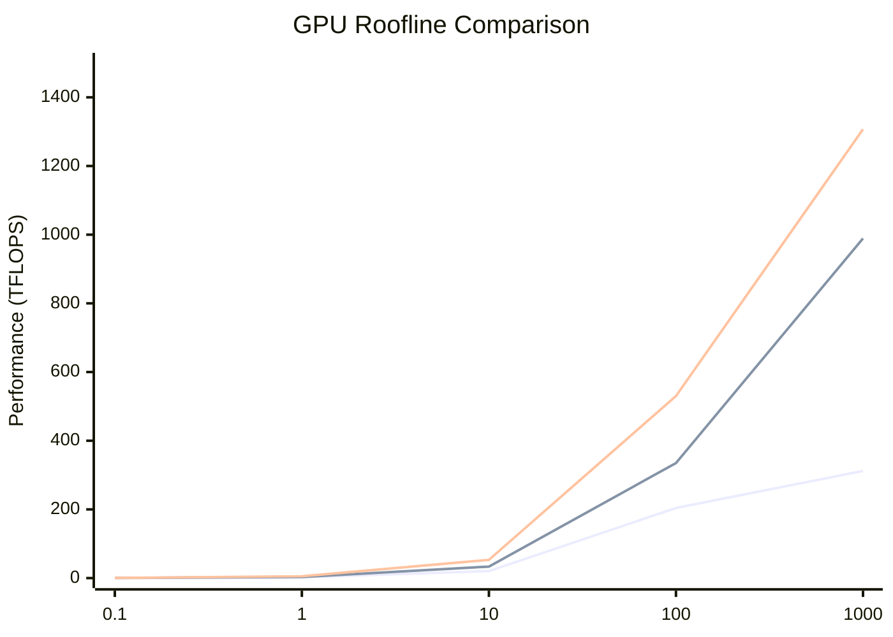
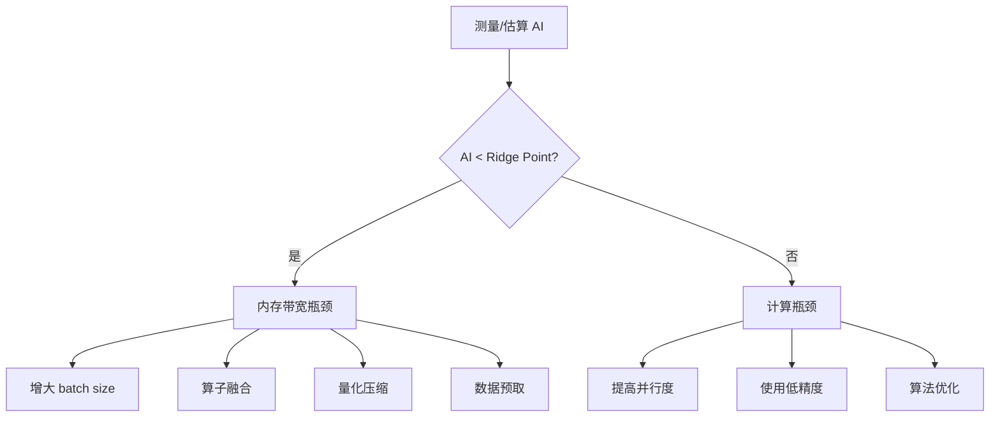

# Roofline 性能模型

Roofline 模型是分析计算密集型应用性能的核心工具，本文档详细介绍其在 LLM 性能评估中的应用。

## 1. 模型基础

### 1.1 核心概念

Roofline 模型建立了**运算强度 (Operational Intensity)** 与** achievable performance **之间的关系。

```
┌─────────────────────────────────────────────────────────────┐
│                     Peak Performance                        │
│                         ┌───────────────┐                   │
│                         │               │                   │
│                         │               │                   │
│  Performance            │    Compute    │                   │
│      ↑                  │     Roof      │                   │
│      │                  │               │                   │
│      │    ──────────────┘               │                   │
│      │                 ╲                 │                   │
│      │                  ╲  Memory        │                   │
│      │                   ╲  Roof         │                   │
│      │                    ╲              │                   │
│      └─────────────────────╲────────────→ Arithmetic        │
│                             Ridge         Intensity         │
└─────────────────────────────────────────────────────────────┘
```

### 1.2 数学定义

**运算强度 (Arithmetic Intensity, AI)**:
```
AI = FLOPs / Bytes
```

**性能上限**:
```
Performance = min(
    Peak_FLOPS,           # 算力屋顶
    AI × Memory_BW        # 内存带宽屋顶
)
```

**脊点 (Ridge Point)**:
```
Ridge_Point = Peak_FLOPS / Memory_BW
```
- AI < Ridge_Point: **内存带宽瓶颈 (Memory Bound)**
- AI > Ridge_Point: **计算瓶颈 (Compute Bound)**

## 2. 硬件 Roofline

### 2.1 不同 GPU 的 Roofline 对比

| GPU | FP16 TFLOPS | Memory BW | Ridge Point | 典型 AI 范围 |
|-----|-------------|-----------|-------------|--------------|
| A100-80GB | 312 | 2.04 TB/s | 153 | 0.1 - 1000 |
| H100-80GB | 989 | 3.35 TB/s | 295 | 0.1 - 1000 |
| MI300X | 1307 | 5.3 TB/s | 247 | 0.1 - 1000 |
| L40S | 183 | 864 GB/s | 212 | 0.1 - 500 |

### 2.2 可视化



## 3. LLM 算子的 Roofline 分析

### 3.1 常见算子的运算强度

```
运算强度 (FLOPs/Byte)
│
│                                    ┌────────────── GEMM (large)
│                              ┌─────┘
│                        ┌─────┘
│                  ┌─────┘
│            ┌─────┘                        ┌────── FlashAttention
│      ┌─────┘
│ ┌────┘                                             ┌────── GEMM (small)
│ │                                           ┌───────┘
│ │                                     ┌──────┘
│ │                               ┌─────┘
│ │                         ┌─────┘
│ │                   ┌─────┘
│ │             ┌─────┘
│ │       ┌─────┘                                              ┌── LayerNorm
│ │  ┌────┘                                              ┌─────┘
│ └──┘                                             ┌─────┘
│                                            ┌─────┘
│                                      ┌─────┘
│                                ┌─────┘
│                          ┌─────┘
│                    ┌─────┘
│              ┌─────┘
│        ┌─────┘                                                    ┌── ReLU
│   ┌────┘
└───┴────┬────┬────┬────┬────┬────┬────┬────┬────┬────┬────┬────┬────→
        0.1   1    10   100  1K  10K  100K
```

### 3.2 具体算子分析

#### GEMM (矩阵乘法)

**小矩阵** (M=1, N=K=4096):
```
FLOPs = 2 × 1 × 4096 × 4096 = 33.5M
Bytes = (1×4096 + 4096×4096 + 1×4096) × 2 = 32.8M
AI = 33.5M / 32.8M = 1.02

在 H100 上:
- Ridge Point = 295
- 1.02 << 295, 严重内存带宽瓶颈
- 理论性能 = 1.02 × 3.35TB/s = 3.4 TFLOPS (仅 0.3% 峰值)
```

**大矩阵** (M=N=K=4096):
```
FLOPs = 2 × 4096³ = 137G
Bytes = (4096² + 4096² + 4096²) × 2 = 134M
AI = 137G / 134M = 1024

在 H100 上:
- 1024 > 295, 计算瓶颈
- 理论性能 = 989 TFLOPS (100% 峰值)
```

#### FlashAttention

```
FLOPs = 4 × batch × heads × seq² × head_dim
Bytes ≈ 4 × batch × heads × seq × head_dim × dtype_size

AI ≈ seq / dtype_size

对于 seq=4096, fp16:
AI = 4096 / 2 = 2048
```

FlashAttention 的运算强度与序列长度成正比，长序列时可以达到计算瓶颈。

#### Layer Normalization

```
FLOPs ≈ 5 × hidden_size  (mean, var, normalize)
Bytes = 2 × hidden_size × dtype_size  (read + write)

AI = 5 / (2 × dtype_size) = 1.25 (fp16)
```

LayerNorm 始终是内存带宽瓶颈。

### 3.3 瓶颈分类表

| 算子 | 典型 AI (FP16) | 瓶颈类型 | 优化方向 |
|------|----------------|----------|----------|
| GEMM (small batch) | 0.5 - 2 | 内存带宽 | 增大 batch size、量化 |
| GEMM (large batch) | 100 - 1000 | 计算 | 使用 Tensor Core |
| FlashAttention | seq/2 | 混合 | 序列并行、分块 |
| LayerNorm | 1.25 | 内存带宽 | 融合 kernel |
| Activation | 0.5 - 2 | 内存带宽 | 融合到 GEMM |
| Embedding Lookup | < 0.1 | 内存带宽 | 缓存、压缩 |

## 4. Roofline 在性能优化中的应用

### 4.1 识别优化机会



### 4.2 案例：优化 Llama Attention

**原始实现** (多个独立 kernel):
```
Q = Linear(hidden)      # AI = 1, 内存瓶颈
K = Linear(hidden)      # AI = 1, 内存瓶颈
V = Linear(hidden)      # AI = 1, 内存瓶颈
scores = Q @ K.T        # AI = 5, 混合
weights = Softmax(scores)  # AI = 0.5, 内存瓶颈
output = weights @ V    # AI = 5, 混合
O = Linear(output)      # AI = 1, 内存瓶颈

总内存访问: 6 × hidden_size × batch × seq × dtype_size
```

**FlashAttention 优化** (融合 kernel):
```
所有操作在一个 kernel 中完成
使用 SRAM 缓存中间结果
重计算代替存储

总内存访问: 4 × hidden_size × batch × seq × dtype_size
AI 提升 1000 倍以上
```

## 5. 实际性能与理论的差距

### 5.1 效率损失来源

| 因素 | 影响 | 典型损失 |
|------|------|----------|
| Kernel launch overhead | 小 kernel 启动开销 | 5-20% |
| Memory bank conflict | 非对齐访问 | 10-30% |
| Tensor Core 效率 | 矩阵维度非对齐 | 10-20% |
| Cache miss | 数据局部性差 | 20-50% |
| Synchronization | 线程同步 | 5-15% |
| Fragmentation | 内存碎片 | 5-10% |

### 5.2 实际 Roofline

```
理论性能
    │
    │    ┌───────────────────┐
    │    │                   │
    │    │    Compute Roof   │
    │    │     (100%)        │
    │────┼───────────────────┘
    │    │    ╲
    │    │     ╲  Practical Roof
    │    │      ╲    (70-80%)
    │    │       ╲
    │    │        ╲
    │    │         ╲
    │    │          ╲
    └────┴───────────╲────────→
                    Ridge
```

实际可达到的性能通常为理论峰值的 70-80%。

## 6. 在框架中的应用

### 6.1 代码实现

```python
class Device:
    def estimate_roofline_flops(
        self, 
        arithmetic_intensity: float,
        dtype: str = "fp16"
    ) -> float:
        """
        基于 Roofline 模型估算可达到的 FLOPS
        """
        peak_flops = self.get_compute_tflops(dtype) * 1e12
        mem_bw = self.get_memory_bw_gbps() * 1e9
        
        ridge_point = peak_flops / mem_bw
        
        if arithmetic_intensity < ridge_point:
            # 内存带宽瓶颈
            return arithmetic_intensity * mem_bw
        else:
            # 计算瓶颈
            return peak_flops
```

### 6.2 使用示例

```python
# 估算 GEMM 性能
device = Device.from_preset("H100-SXM-80GB")

# 小矩阵
m, n, k = 1, 4096, 4096
flops = 2 * m * n * k
bytes_accessed = (m*k + k*n + m*n) * 2
ai = flops / bytes_accessed

achievable = device.estimate_roofline_flops(ai, "fp16")
print(f"Arithmetic Intensity: {ai:.2f}")
print(f"Achievable FLOPS: {achievable/1e12:.2f} TFLOPS")
print(f"Utilization: {achievable/device.config.fp16_tflops/1e12*100:.1f}%")
```

输出:
```
Arithmetic Intensity: 1.02
Achievable FLOPS: 3.42 TFLOPS
Utilization: 0.3%
```

## 7. 参考资料

1. Williams, S., Waterman, A., & Patterson, D. (2009). Roofline: an insightful visual performance model for multicore architectures.
2. NVIDIA. (2023). CUDA C++ Programming Guide.
3. Dao, T., et al. (2022). FlashAttention: Fast and Memory-Efficient Exact Attention with IO-Awareness.
