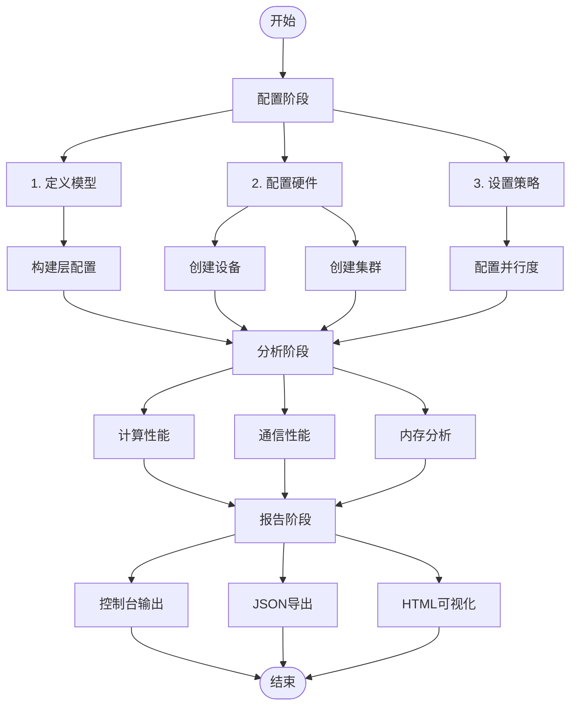
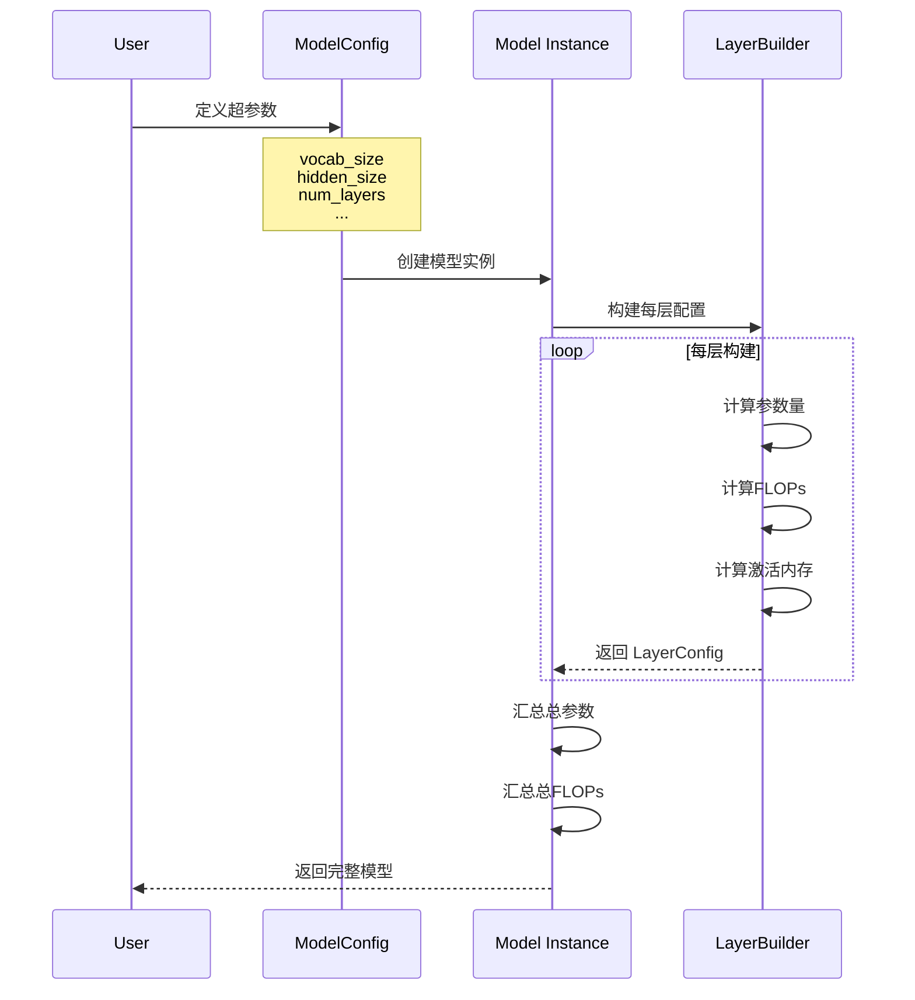
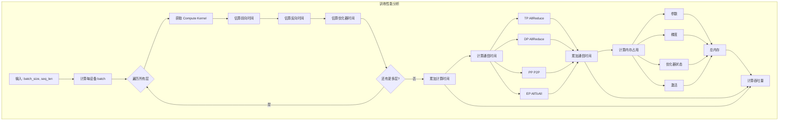
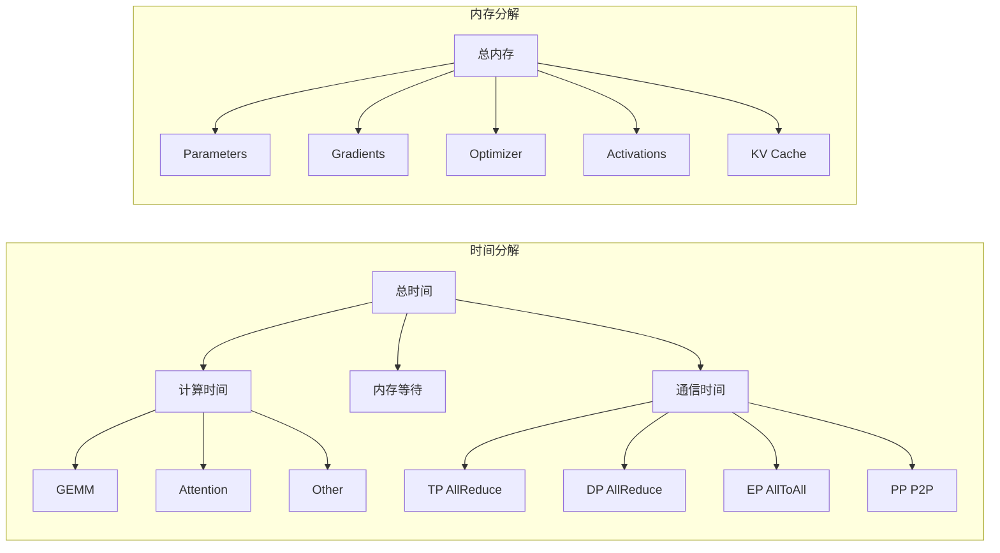

# 工作流程与数据流

本文档详细介绍使用 LLM Performance Evaluator 进行性能评估的完整工作流程。

## 1. 整体流程



## 2. 配置阶段

### 2.1 模型配置流程



### 2.2 硬件配置流程

```
┌───────────────────────────────────────────────────────────────┐
│                     硬件配置步骤                               │
├───────────────────────────────────────────────────────────────┤
│                                                               │
│  1. 选择或定义 Device                                         │
│     ┌─────────────────┐    ┌─────────────────┐               │
│     │  预设设备       │ or │  自定义配置     │               │
│     │  • H100-SXM    │    │  • FP16 TFLOPS │               │
│     │  • A100-SXM    │    │  • Memory BW   │               │
│     │  • MI300X      │    │  • VRAM        │               │
│     └────────┬────────┘    └────────┬────────┘               │
│              │                      │                         │
│              └──────────┬───────────┘                         │
│                         ▼                                     │
│              ┌─────────────────────┐                         │
│              │    Device 实例      │                         │
│              └─────────────────────┘                         │
│                                                               │
│  2. 配置 Cluster                                              │
│     ┌──────────────────────────────────────────┐             │
│     │  • 设备数量 (num_devices)                │             │
│     │  • 每节点设备数 (devices_per_node)       │             │
│     │  • 机内带宽 (intra_node_bw)              │             │
│     │  • 机间带宽 (inter_node_bw)              │             │
│     └─────────────────────┬────────────────────┘             │
│                           ▼                                   │
│              ┌─────────────────────┐                         │
│              │    Cluster 实例     │                         │
│              └─────────────────────┘                         │
│                                                               │
└───────────────────────────────────────────────────────────────┘
```

### 2.3 策略配置流程

| 步骤 | 操作 | 说明 |
|------|------|------|
| 1 | 确定并行维度 | TP × PP × DP × EP = 总 GPU 数 |
| 2 | 设置微批次 | micro_batch_size |
| 3 | 启用优化 | activation_checkpointing, zero_stage |
| 4 | 验证配置 | 检查 world_size 是否匹配 |

```python
# 配置示例
strategy = StrategyConfig(
    tp_degree=8,          # Tensor Parallelism
    pp_degree=1,          # Pipeline Parallelism
    dp_degree=1,          # Data Parallelism
    ep_degree=1,          # Expert Parallelism
    activation_checkpointing=True,
    zero_stage=1,
)

assert strategy.world_size == 8  # 验证
```

## 3. 分析阶段

### 3.1 训练分析流程



### 3.2 推理分析流程

```
┌─────────────────────────────────────────────────────────────────┐
│                      推理性能分析流程                            │
├─────────────────────────────────────────────────────────────────┤
│                                                                 │
│  输入参数:                                                       │
│  • batch_size: 并发请求数                                        │
│  • prompt_len: 输入 prompt 长度                                  │
│  • generation_len: 生成 token 数量                               │
│                                                                 │
│  ┌──────────────────────┐      ┌──────────────────────┐        │
│  │     Prefill 阶段     │      │     Decode 阶段      │        │
│  │     (TTFT)          │─────▶│     (TPOT/TPS)      │        │
│  └──────────────────────┘      └──────────────────────┘        │
│                                                                 │
│  Prefill 计算:                                                  │
│  ┌─────────────────────────────────────────────────────────┐   │
│  │ for layer in model.layers:                              │   │
│  │   1. 获取 compute kernel (batch_size, prompt_len)      │   │
│  │   2. 估算执行时间 (Roofline 模型)                       │   │
│  │   3. 累加 TP/EP 通信时间                                │   │
│  │ end                                                     │   │
│  │                                                         │   │
│  │ TTFT = sum(layer_times) + comm_overhead                 │   │
│  └─────────────────────────────────────────────────────────┘   │
│                                                                 │
│  Decode 计算 (per token):                                       │
│  ┌─────────────────────────────────────────────────────────┐   │
│  │ for layer in model.layers:                              │   │
│  │   1. 获取 compute kernel (batch_size, seq_len=1)       │   │
│  │   2. 加上 KV Cache 读取时间 (内存带宽)                  │   │
│  │   3. 累加通信时间                                       │   │
│  │ end                                                     │   │
│  │                                                         │   │
│  │ TPOT = sum(layer_times) + kv_cache_read + comm         │   │
│  │ TPS = batch_size / TPOT                                 │   │
│  └─────────────────────────────────────────────────────────┘   │
│                                                                 │
│  内存计算:                                                       │
│  ┌─────────────────────────────────────────────────────────┐   │
│  │ 1. 参数内存: params × dtype_size / tp_degree           │   │
│  │ 2. KV Cache: 2 × layers × heads × dim × seq × batch    │   │
│  │ 3. 激活内存: 小 (inference 不需要存所有激活)            │   │
│  └─────────────────────────────────────────────────────────┘   │
│                                                                 │
└─────────────────────────────────────────────────────────────────┘
```

### 3.3 性能分解计算



## 4. 数据流详解

### 4.1 训练数据流

```
Input: (batch_size, seq_len)
│
├─► Model.build_layers()
│   ├─► For each layer:
│   │   ├─► input_shape
│   │   ├─► output_shape  
│   │   ├─► params_count
│   │   ├─► flops
│   │   └─► activation_bytes
│   └─► Return List[LayerConfig]
│
├─► TrainingAnalyzer.analyze()
│   ├─► For each layer:
│   │   ├─► ComputeKernelRegistry.get()
│   │   │   └─► Roofline estimation
│   │   └─► Sum compute time
│   │
│   ├─► CommKernelRegistry
│   │   ├─► TP AllReduce time
│   │   ├─► DP AllReduce time  
│   │   ├─► PP P2P time
│   │   └─► EP AllToAll time
│   │
│   ├─► Memory estimation
│   │   ├─► params / tp_degree
│   │   ├─► grads (consider ZeRO)
│   │   ├─► optimizer states
│   │   └─► activations (consider checkpointing)
│   │
│   └─► Return TrainingResult
│
└─► Reporter.report_training()
    ├─► Console table
    ├─► JSON export
    └─► HTML visualization
```

### 4.2 推理数据流

```
Input: (batch_size, prompt_len, generation_len)
│
├─► Model (same as training)
│
├─► InferenceAnalyzer.analyze()
│   ├─► Prefill phase
│   │   ├─► All layers with seq=prompt_len
│   │   ├─► Communication overhead
│   │   └─► TTFT = total time
│   │
│   ├─► Decode phase
│   │   ├─► All layers with seq=1
│   │   ├─► KV Cache read time
│   │   ├─► Communication overhead
│   │   ├─► TPOT = total time
│   │   └─► TPS = batch_size / TPOT
│   │
│   ├─► Memory estimation
│   │   ├─► params / tp_degree
│   │   └─► KV Cache = 2×layers×heads×dim×seq×batch
│   │
│   └─► Return InferenceResult
│
└─► Reporter.report_inference()
    ├─► Console table
    ├─► JSON export
    └─► HTML visualization
```

## 5. 关键计算步骤

### 5.1 Roofline 计算

```python
def roofline_estimation(flops, bytes_accessed, device):
    """
    1. 计算运算强度: AI = flops / bytes_accessed
    2. 计算脊点: ridge = device.peak_flops / device.mem_bw
    3. 判断瓶颈:
       - if AI < ridge: memory_bound
         achievable = AI * device.mem_bw
       - else: compute_bound
         achievable = device.peak_flops
    4. 计算时间: time = flops / achievable
    """
    ai = flops / bytes_accessed
    ridge = device.peak_flops / device.mem_bw
    
    if ai < ridge:
        # 内存带宽瓶颈
        achievable = ai * device.mem_bw
    else:
        # 计算瓶颈
        achievable = device.peak_flops
    
    return flops / achievable
```

### 5.2 通信时间计算

```python
def allreduce_time(data_size, num_gpus, bandwidth):
    """
    Ring AllReduce:
    - 步骤: 2 * (n-1)
    - 每步数据: data_size / n
    - 时间: steps * (data_per_step / bandwidth) + n * latency
    """
    steps = 2 * (num_gpus - 1)
    data_per_step = data_size / num_gpus
    transfer_time = steps * data_per_step / bandwidth
    latency_time = num_gpus * 1e-6  # 1us per step
    return transfer_time + latency_time
```

### 5.3 内存计算

```python
def memory_estimation(model, strategy, batch_size, seq_len):
    """
    1. 参数内存: model.total_params * dtype_size / tp_degree
    2. 梯度内存: param_memory (ZeRO-2/3 会除以 dp)
    3. 优化器: 2 * param_memory * 4 (fp32) (ZeRO-1/3 会除以 dp)
    4. 激活: sum(layer.activation) * batch_size
       - 如果 activation_checkpointing: / num_layers
    5. KV Cache (inference only): 
       2 * num_layers * num_kv_heads * head_dim * seq_len * batch_size
    """
    pass
```

## 6. 输出格式

### 6.1 控制台输出

```
================================================================================
                              TRAINING PERFORMANCE
================================================================================

[Throughput]
  Samples/sec                        X.XX
  Tokens/sec                    X.XXK tokens/s

[Time]
  Time per step                   XX.XX s
  Time to solution              XX.XX hours

[Memory]
  Memory per GPU                  XX.XX GB

[Breakdown]
  Compute:       XX.XX ms (XX.X%)
  Communication: XX.XX ms (XX.X%)
  Memory Wait:   XX.XX ms (XX.X%)
================================================================================
```

### 6.2 JSON 结构

```json
{
  "metadata": {
    "model": "llama-7b",
    "hardware": "H100-8GPU",
    "strategy": "TP8"
  },
  "result": {
    "throughput": {
      "samples_per_sec": 0.5,
      "tokens_per_sec": 2048
    },
    "time": {
      "time_per_step_sec": 64.0,
      "time_per_step_ms": 64000
    },
    "memory": {
      "memory_per_gpu_gb": 76.23
    },
    "breakdown": {
      "compute_sec": 51.2,
      "communication_sec": 12.8,
      "compute_percent": 80.0,
      "communication_percent": 20.0
    }
  }
}
```

## 7. 扩展点

| 扩展类型 | 接口 | 示例 |
|----------|------|------|
| 新模型 | 继承 `BaseModel` | `class QwenModel(BaseModel)` |
| 新 Kernel | 注册到 Registry | `compute_registry.register(...)` |
| 新策略 | 扩展 `StrategyConfig` | 添加新的并行维度 |
| 新报告 | 实现 Reporter | `class CSVReporter(...)` |
